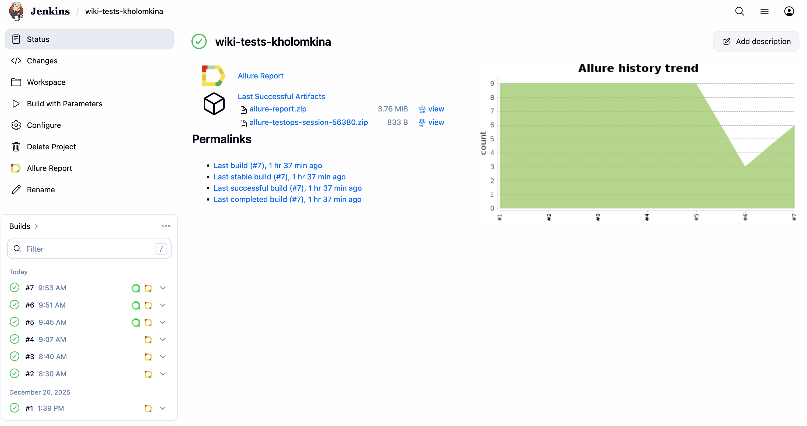
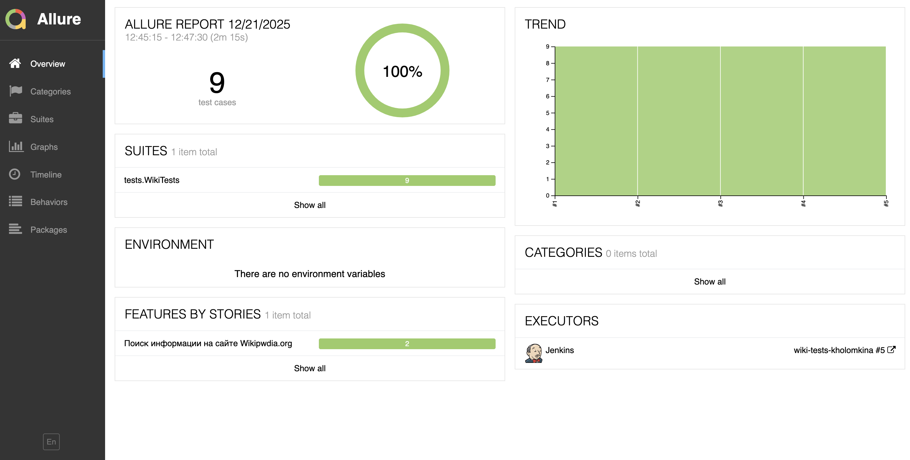
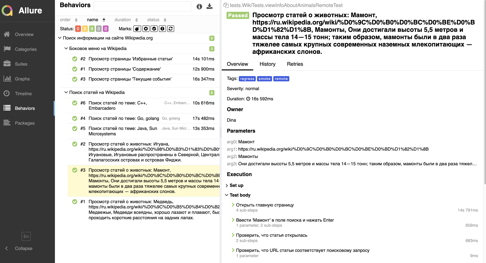
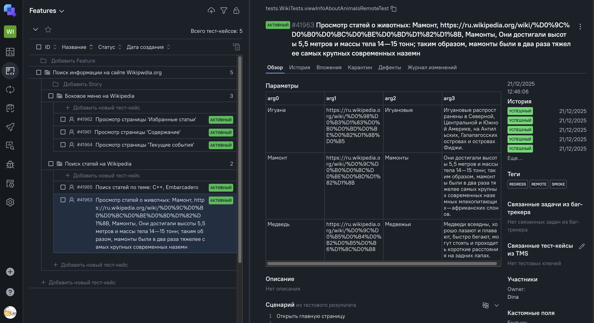
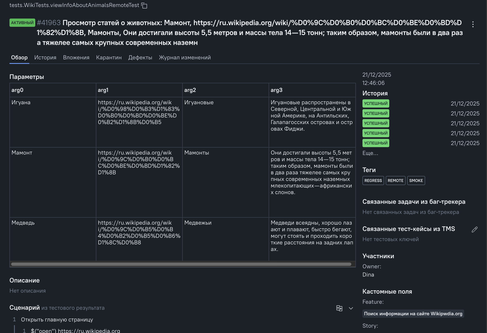
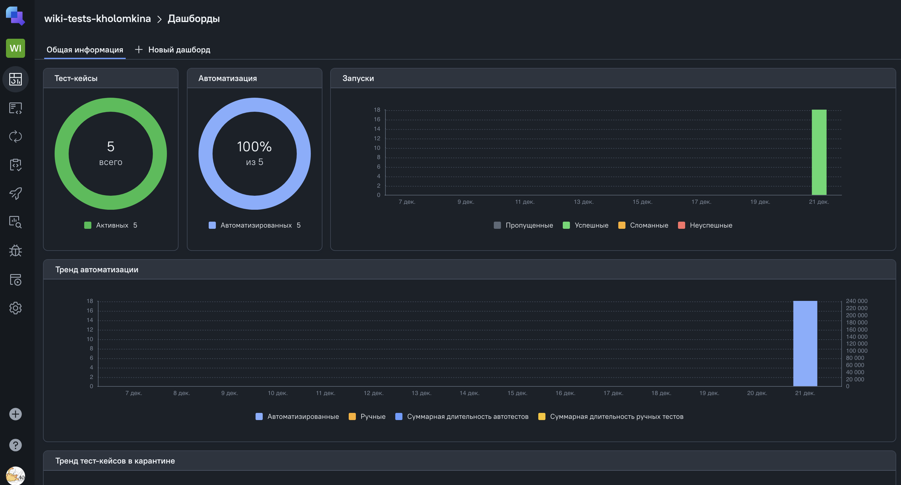
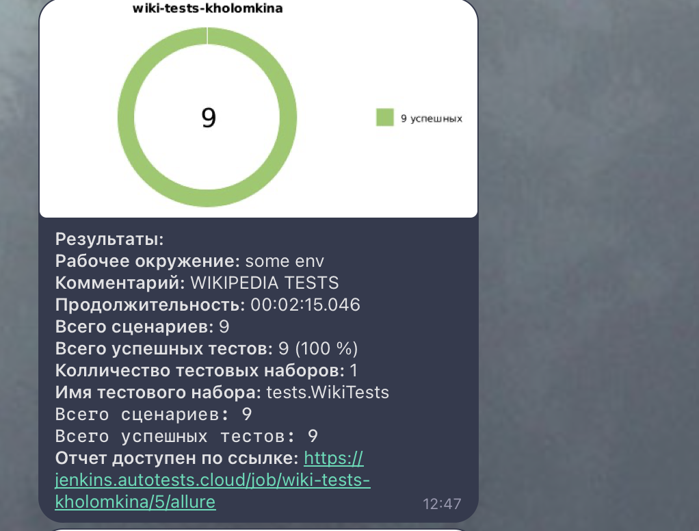
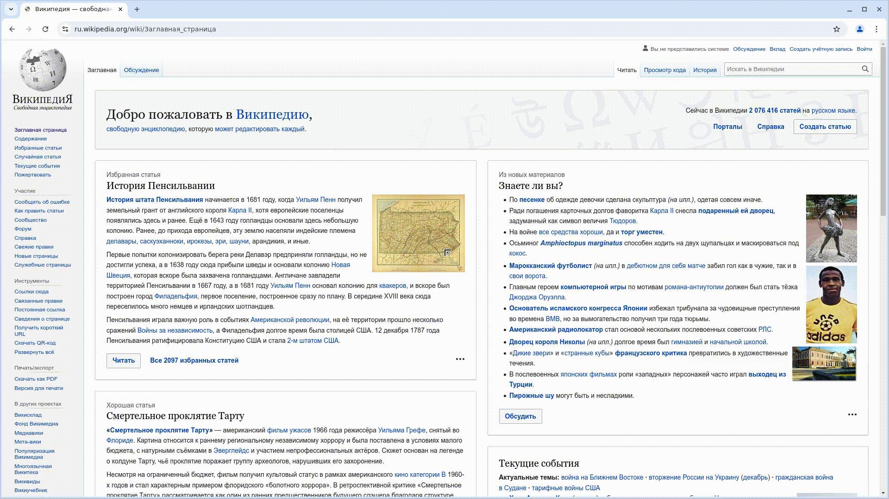

# Проект по автоматизации тестовых сценариев для сайта [Wikipedia](https://ru.wikipedia.org/wiki/%D0%97%D0%B0%D0%B3%D0%BB%D0%B0%D0%B2%D0%BD%D0%B0%D1%8F_%D1%81%D1%82%D1%80%D0%B0%D0%BD%D0%B8%D1%86%D0%B0) 


## **Содержание:**

* [Технологии и инструменты](#star-технологии-и-инструменты)

* [Реализованные проверки](#open_file_folder-реализованные-проверки)

* [Запуск из терминала](#computer-запуск-из-терминала)

* [Сборка в Jenkins](#-сборка-в-jenkins)

* [Allure отчет](#-allure-отчет)

* [Интеграция с Allure TestOps](#-интеграция-с-allure-testops)

* [Уведомление в Telegram при помощи бота](#-уведомление-в-telegram-при-помощи-бота)

* [Примеры видео выполнения тестов на Selenoid](#-примеры-видео-выполнения-тестов-на-selenoid)  
  <br>


---
## :star: Технологии и инструменты:

<p>
<a href="https://www.jetbrains.com/idea/"></a>
<a href="https://www.java.com/ru/"></a>
<a href="https://junit.org/"></a>
<a href="https://ru.selenide.org/"></a>
<a href="https://allurereport.org/"></a>
<a href="https://gradle.org/"></a>
<a href="https://www.jenkins.io/"></a>
<a href="https://aerokube.com/selenoid/latest/"></a>
<a href="https://qameta.io/"></a>
</p>  
<br>


---
## :open_file_folder: Реализованные проверки:

- Проверка работы кнопок меню: "Содержание", "Избранные статьи", "Текущие события"
- Поиск статей через строку поиска и через страницу поиска. 

Для обеспечения большего покрытия для тестирования поиска используются параметризованные тесты (аннотация @ParameterizedTest, передача данных в тест через @MethodSource и @CsvSource)
  <br>


---
## :computer: Запуск из терминала:

### Локальный запуск

Для локального запуска тестов используйте следующую команду:
```
./gradlew clean local-test
```

---

### Запуск на Selenoid

Для запуска тестов удаленно на Selenoid используйте команду, где в параметр remoteUrl передается URL селеноида с кредами для доступа:
```
./gradlew clean remote-test -DremoteUrl=URL_SELENOID
```

---
##  [Сборка в Jenkins:](https://jenkins.autotests.cloud/job/wiki-tests-kholomkina)

  
<br>

---
##  [Allure отчет:](https://jenkins.autotests.cloud/job/wiki-tests-kholomkina/5/allure/)

**Overview:**


<br><br>

**Tests:**

  
<br>


---
##  [Интеграция с Allure TestOps:](https://allure.autotests.cloud/project/5058/test-cases/41965?treeId=9886)

**Тест-кейсы:**


<br><br>

**Отображение параметризации в тест-кейсе:**

  
<br>

**Dashboard прогонов:**

  
<br>


---
##  Уведомление в Telegram при помощи бота:


<br>


---
##  Примеры видео выполнения тестов на Selenoid:

 